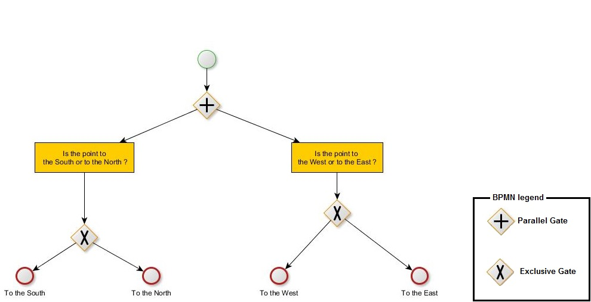
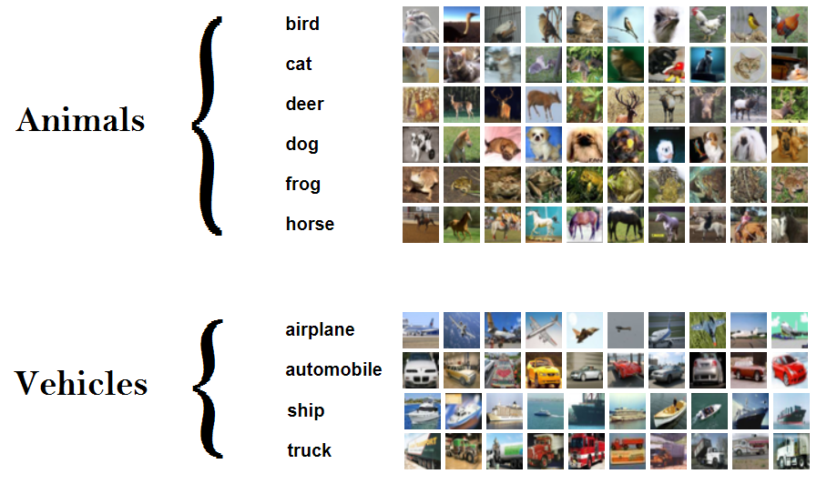

<h1> Neural network to learn paths in decision tree </h1>

The main characterist of supervised classification with neural network is produce prediction with one softmax layer. We implement and experiment neural network with output as path in a decision tree.  Our approach recursively partition the semantic of input space and assign label to final nodes. Our neural network jointly learns to extract features from image via CNN and classify object via decision tree. The structure of neural network is fixed and each gate is answered with one classic softmax layer. The neural network is derivable and can be learn end-to-end manner as usual. To use our architecture dataset need to be labeled as tree-based structure.

 

Recent developpement in deep learning regarding smarter results introduced decision tree as output of neural network (rf:Yolo9000). Decision tree are a more informative manner to explain a decision better than class MLP vector-like prediction. Decision tree structure class like an hierarchy of ideas.

Classic softmax layer is already exclusive so why do we bother with an exlcusive decision tree ? There are many answers. 
<ul>
<li> If you split one big question Q to a sequence of question q1 q2 q3. Give good answer to q1 and q2 but fail to q3 give you an limited distance to the groundtruth in the decision tree because you are arrived and succeed to q2. For example detect "cat" as "dog" is more acceptable than a "cat" with "car", because cats and dogs are of the same super-class "mammal". </li>
<li> It enrich the dataset with more information <a href="https://arxiv.org/abs/1612.08242"> YOLO9000</a>. It gives intermediate information to your data to the system. "cat" and "dog" are of the same category mammals, "car" and "trucks" are vehicles etc.... . And more, each possible answer at each stage is reduced. </li>
<li> Spliting answers allow to a better understanging of neural network decision. </li>
<li> Bottom of tree can be poorly sampled because data is rare, but super-class can be correctly chosen. Our approach is more robust to the lack of data. </li>
<li> if the network sees a picture and detect with high confidence an animal but is uncertain
what type of animal it is, we still know it is an animal. </li>
</ul>

My contribution contains :
<ul>
<li> Keras implementation of a new block of layers I called "multi-optional-softmax". It unify code of exclusive and inclusive nodes. </li>
<li> A new way to save labels which describe a path on the decision tree. I introduce the storage of arbitrary value -1 to disable backpropagation through softmax layers. </li>
<li>  Experiments of our multi-optional-softmax summarized at the end of this page </li>
</ul>

 Keras implementation could not do this properly that's why I create the function "multi-optional-softmax(W)" which return a "weigthed-optional-multi-softmax" layer.  

<!-- ------------------------------------------------------------ -->
<h2> Decision tree implementation </h2>

Decision tree contains 2 kinds of nodes : exclusive gate (one answer among N) and parallel gate (all N sub-questions are asked).

<h3> Parallel gate </h3>

Neural network can answer to some questions at the same time. The neural network take all pathes from one inclusive node  ("+" symbol below). 

 In this example we answer to a succession of questions. One point in the west or east ? Are points in the north or south ?

The multi-optional-softmax contains 2 softmax.

Labels to compute loss and run back-propagation process are as follow :
<table>
 <tr> <th>     Class name    </th> <th> optional-softmax1 label </th> <th> optional-softmax2 label </th> </tr>
  <tr> <th> south-west </th> <td> Psouth=1;Pnorth=0 </td> <td> Pwest=1;Peast=0 </td> </tr>
  <tr> <th> south-east </th> <td> Psouth=1;Pnorth=0 </td> <td> Pwest=0;Peast=1 </td> </tr>
  <tr> <th> north-west </th> <td> Psouth=0;Pnorth=1 </td> <td> Pwest=1;Peast=0 </td> </tr>
  <tr> <th> north-east </th> <td> Psouth=0;Pnorth=1 </td> <td> Pwest=0;Peast=1 </td> </tr> 
 </table>

<h3> Exclusive gate </h3>

Neural network can answer to a succession of questions. The neural network answer to a question by taking one path from one exclusive node ("X" symbol below). For example we can answare : This point is in the west or east ? If it is in the west, is it in the south or north ?

 In our multi-one-hot-vector exclusive gates are coded as classic softmax layers.

Some label havea special value "-1" to disable backpropagation through those softmax layers.

So  the point : (-0.33;0.44) have label [(1;0);(0;1)] meaning "south-west"
The point : (0.92;-0.15) have label [(0;1);(-1;-1)] meaning the point is to the East, so know South/North softmax is disabled with "-1".

Labels are as follow :
<table>
 <tr> <th>     Class name    </th> <th> optional-softmax1 label </th> <th> optional-softmax2 label </th> </tr>
  <tr> <th> west-south </th> <td> Pwest=1;Peast=0 </td> <td> Psouth=1;Porth=0 </td> </tr>
  <tr> <th> west-north </th> <td> Pwest=1;Peast=0 </td> <td> Psouth=0;Pnorth=1 </td> </tr>
  <tr> <th> east </th> <td> Pwest=0;Peast=1 </td> <td> Psouth=-1;Pnorth=-1 </td> </tr> 
 </table>

<!-- ------------------------------------------------------------ -->

<h2> Application on CIFAR10 </h2>

We experiment a deep learning on CIFAR10 with bother softmax layers and our multi-optional-softmax. Figure below show decision tree process learnt by . We use the neural network on . Cifar10 can be downloaded :  https://www.cs.toronto.edu/~kriz/cifar.html 

To experiment our contributions we split the famous CIFAR10 dataset to 2 super-classes : animals and vehicles. We will try classify the best we can if one image belong to "animal" or "vehicle" category and then which animal/vehicle is it.

Here the corresponding decision tree

Our multi-optional-softmax is coded as follow :
<ul>
<li> optional-softmax1: Panimal;Pvehicle </li>
<li> optional-softmax2: Pbird; Pcat; Pdeer; Pdog; Pfrog; Phorse;</li>
<li> optional-softmax3: Pair; Pcar; Pship; Ptruck</li>
</ul>

To code label as see in section "Decision Tree implementation" when animal is cat optional-softmax3 is disabled with -1 values. optional-softmax1 label is Panimal=1;Pvehicle=0. optional-softmax2 label contains Pcat=1 and other probabilities=0.

<h3> Experiments </h3>

Here the results of classic softmax and our multi-optional-softmax implementation. 

 After 25 epochs 
<table>
 <tr> <th>         </th> <th> animals or vehicles ? </th> <th> CIFAR10 </th> </tr>
  <tr> <th> softmax    2 output </th> <td> 92.11%               </td> <td> - </td> </tr>
  <tr> <th> softmax   10 output </th> <td> 92.63% <red>*</red>               </td> <td> <b>66.69%</b> </td> </tr>
 <tr> <th> multi optional softmax </th> <td> <b>93.30%</b>             </td> <td> 65.86% </td> </tr>
 </table>
&#42; To classify "animals or vehicles" with 10 output softmax we look if the class predicted belong to animal or vehicle super-class. 

 

After 50 epochs
<table>
 <tr> <th>         </th> <th> animals or vehicles ? </th> <th> CIFAR10 </th> </tr>
  <tr> <th> softmax    2 output </th> <td> 92.67%               </td> <td> - </td> </tr>
  <tr> <th> softmax   10 output </th> <td> 93.15% <red>*</red>               </td> <td> <b>68.33%</b> </td> </tr>
 <tr> <th> multi optional softmax </th> <td> <b>93.47%</b>             </td> <td> 66.11% </td> </tr>
 </table>

<b> We can observe super-classes are better described when we add their sub-classes information in the learning process. </b>

More complex decision logic are possible, like "at least N path among M with N<M", but not possible apriori with softmax layer build to choose one decision to each stage of decision tree.

<h2> References </h2>

Alex Krizhevsky, <it>Learning Multiple Layers of Features from Tiny Images</it>, 2009. https://www.cs.toronto.edu/~kriz/cifar.html  

Joseph Redmon an Ali Farhadi, <it> YOLO9000: Better, Faster, Stronger</it>, CoRR journal abs/1612.08242, 2016, http://arxiv.org/abs/1612.08242

Yongxin Yang and Irene Garcia Morillo and  Timothy M. Hospedales, <it> Deep Neural Decision Trees </it>, CoRR journal abs/1806.06988, 2018, http://arxiv.org/abs/1806.06988

Yani Ioannou and Duncan P. Robertson and Darko Zikic and Peter Kontschieder and Jamie Shotton and Matthew Brown and Antonio Criminisi, <it> Decision Forests, Convolutional Networks and the Models in-Between </it>, CoRR journal abs/1603.01250, 2016, http://arxiv.org/abs/1603.01250

