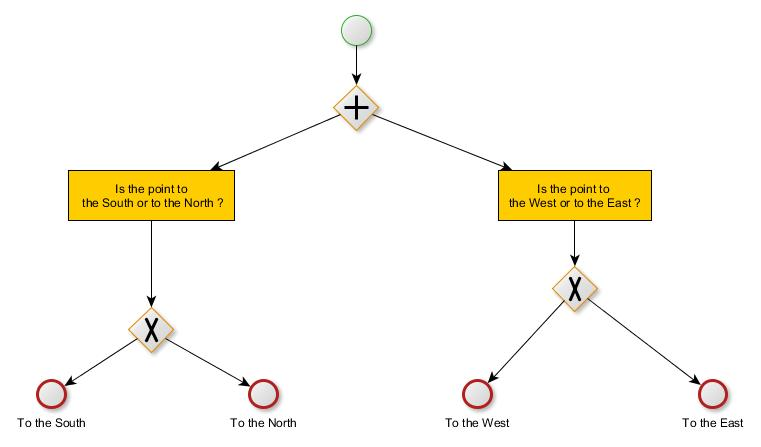
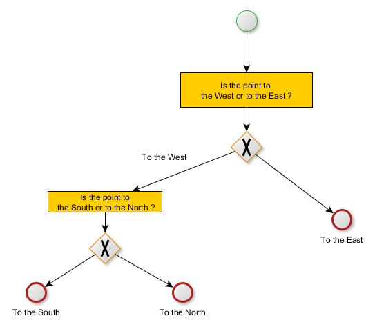
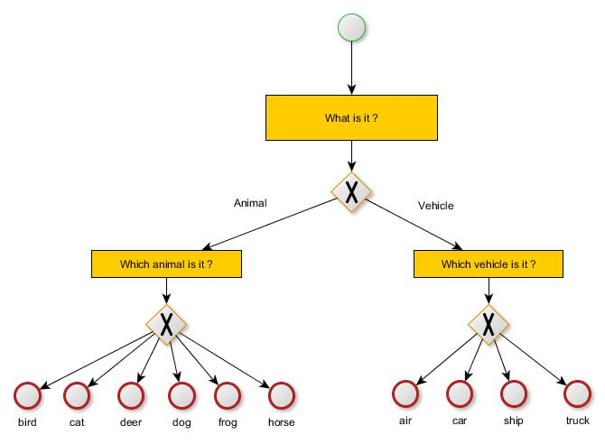

<h1> Neural network and decision tree </h1>

The main characterist of supervised classification with neural network is produce prediction with one softmax layer. I implement and experiment neural network with output as path in a decision tree. Some node of this tree can be inclusive or exclusive. Recent developpement in deep learning regarding smarter results introduced decision tree as output of neural network. I propose "optional-multi-softmax" Keras implementation witch unify inclusive and exclusive nodes of those decision tree.

This tree decision process is coded as multi-softmax output layer. The expected path (i.e. label) of the neural network is coded with multi-softmax.

Softmax is already exclusive so why do we bother with an exlcusive decision tree ? There are many answer. 
<ul>
<li> If you split one big question Q to a sequence of question q1 q2 q3. Give good answer to q1 and q2 but fail to q3 give you an limited distance to the groundtruth in the decision tree because you are arrived and succeed to q2. For example detect "cat" as "dog" is more acceptable than a "cat" with "car", because cats and dogs are of the same category "mammal". </li>
<li> It enrich the dataset with more information <a href="https://arxiv.org/abs/1612.08242"> YOLO9000</a>. It gives intermediate information to your data to the system. "cat" and "dog" are of the same category mammals, "car" and "trucks" are vehicles etc.... . And more, each possible answer at each stage is reduced. </li>
<li> Spliting answers allow to a better understanging of neural network decision. </li>
</ul>

My contribution contains :
<ul>
<li> Keras implementation of a new block of layers I called "multi-optional-softmax". It unify code of exclusive and inclusive nodes. </li>
<li> A new way to save labels which describe a path on the decision tree. I introduce the storage of arbitrary value -1 to disable backpropagation through softmax layers. </li>
</ul>

Keras implementation could not do this properly that's why I create the function "CE(W)" which return a "weigthed-optional-multi-softmax" layer.

 More complex decision logic are possible, like "at least N path among M with N<M", but not possible apriori with softmax layer build to choose one decision to each stage of decision tree.

<h2> Example with inclusive path </h2>

Neural network can answer to those question at the same time.
One point in the west or east ?
Are points in the north or south ?

Neural network have 2 output softmax :
One label associated to one point have this pattern : [ (Pwest;Peast) ; (Pnorth; Psouth) ]
So  the point : (-0.33;0.44) have label [(1;0);(0;1)] meaning "south-west"
One correct prediction can be [(0.2;0.8);(0.1;0.9)]

<h2> Example with exclusive path </h2>

Neural network can answer to those questions at the same time.

Are points in the west or east ?
If it is in the west, is it in the north ?

The label contains multi-one-hot-vector. Some have a special value "-1" to disable backpropagation.

So  the point : (-0.33;0.44) have label [(1;0);(0;1)] meaning "south-west"
The point : (0.92;-0.15) have label [(0;1);(-1;-1)] meaning the point is to the East, so know South/North softmax is disabled with "-1".

<h2> Application </h2>

We experiment a deep learning on CIFAR10 with bother our multi-optional-softmax and softmax layers. Figure below show decision tree process learnt.

